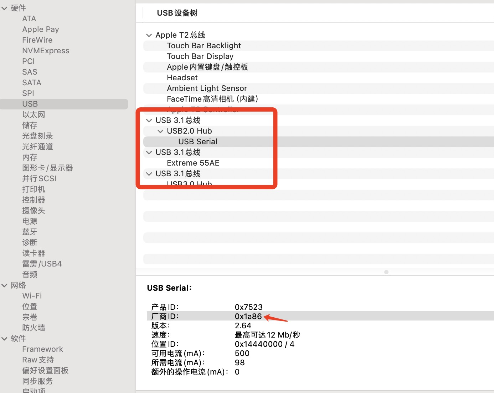
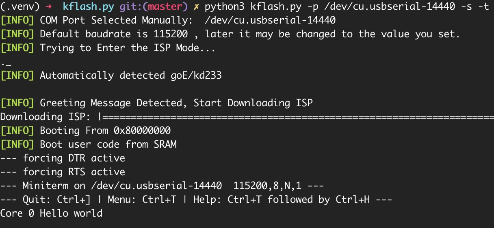

# K210 开发板Mac开发环境相关

官方开发相关地址: http://www.yahboom.net/study/K210-Developer-kit

最近搞了K210开发板玩，由于说明书并未给出MacOS开发环境搭建，因此记录一下Mac开发环境搭建。

- IDE: VSCode 
- 
## IDE

VSCode

## 开发板串口驱动程序

USB转串口macOS厂商驱动程序 https://www.wch.cn/download/CH341SER_MAC_ZIP.html

```
> ls /dev/tty.usb*

/dev/tty.usbserial-14440  #  tty.usbserial-14440 为板子串口

```

安装完驱动后，USB连接板子，可以在 通用 -> 系统报告 -> USB -> USB设备中树 中看是否有产商ID为[0x1a86],有说明工作正常


## 编译工具

安装CMake

https://cmake.org/download/  选择MacOS版本安装

```
> vim ~/.bash_profile
# 添加如下内容
export CMAKE_ROOT=/Applications/CMake.app/Contents/bin/
export PATH=$CMAKE_ROOT:$PATH

> source ~/.bash_profile

```

如果本机没安装isl，则需要安装isl库,否则会报找不到libisl.dylib库错误

```
> brew install isl

```

## SDK和HelloWorld例子

https://github.com/kendryte/kendryte-standalone-sdk


### toolchain

下载toolchain https://github.com/kendryte/kendryte-gnu-toolchain/releases

或者自己从下面编译
https://github.com/kendryte/kendryte-gnu-toolchain

https://github.com/riscv-collab/riscv-gnu-toolchain


## 编译

进入kendryte-standalone-sdk目录


```
> mkdir build && cd build
> cmake .. -DPROJ=hello_world -DTOOLCHAIN=/opt/kendryte-toolchain/bin
> make

# /opt/kendryte-toolchain/bin 为toolchain的path
# 完成后会在build目录下生成hello_world.bin
```

## kflash 烧写固件

https://github.com/kendryte/kflash.py


依赖库

```
pip3 install pyserial
pip3 install pyelftools
```
烧写固件
```
> python3 kflash.py -p /dev/cu.usbserial-14440 -s -t hello_world.bin # -s 把固件写入SRAM内存,断电会恢复 -t 烧写完成打开终端
> python3 kflash.py -p /dev/cu.usbserial-14440 -t hello_world.bin # 不带-s固件永久性写入芯片Flash

```

成功如下图

